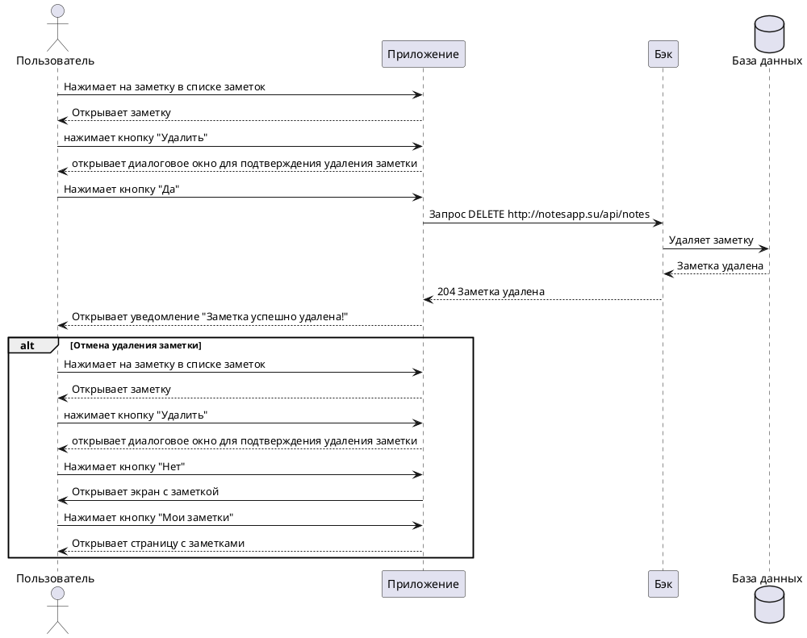

# Пользовательский сценарий «Удаление заметки»

## Действующие лица:

1. Пользователь

2. Приложение

3. Бэк

4. База данных

## Предварительные условия

Пользователь должен находиться на главном экране.

## Выходные условия

Выбранная пользователем заметка удалилась из базы и из списка заметок.

## Основной сценарий

1. Пользователь нажимает на заметку в списке заметок.

2. Приложение открывает заметку.

3. Пользователь нажимает кнопку **Удалить**.

4. Приложение открывает диалоговое окно для подтверждения удаления заметки.

5. Пользователь нажимает кнопку **Да**.

6. Приложение отправляет запрос `DELETE http://notesapp.su/api/notes` Бэку на удаление выбранной заметки.

7. Бэк удаляет заметку из Базы данных.

8. Бэк возвращает Приложению ответ 204 «Заметка успешно удалена».

9. Приложение открывает пользователю уведомление «Заметка успешно удалена!».

## Альтернативный сценарий

1. Пользователь нажимает на заметку в списке заметок.

2. Приложение открывает заметку.

3. Пользователь нажимает кнопку **Удалить**.

4. Приложение открывает диалоговое окно для подтверждения удаления заметки.

5. Пользователь нажимает кнопку **Нет**.

6. Приложение открывает пользователю экран с заметкой и кнопками **Редактировать**, **Удалить**, **Мои заметки**.

7. Пользователь нажимает **Мои заметки**.

8. Приложение открывает главный экран со списком заметок.

## Диаграмма последовательности

